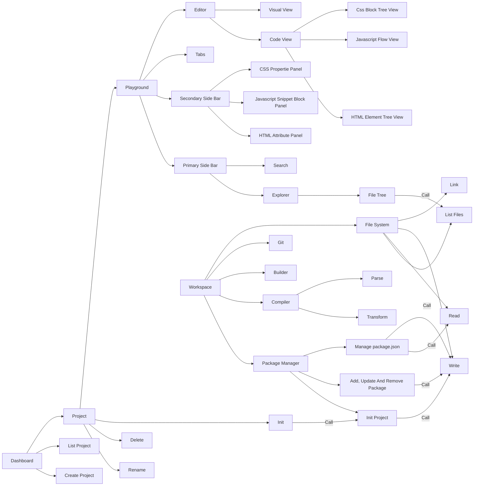

## 依赖包

- tab 页：react-tabs
- html 元素树：react-complex-tree
- html 和 css 属性面板表单数据：使用 @webref/elements @webref/css @webref/idl @mdn/browser-compat-data (mdn-data 仓库说快要弃用了 2025-03-04)
  - _LATER_ tailwindcss 类列表
- _LATER_ js 流程：@xyflow/react
- _LATER_ js 属性展示：react-json-tree
- _LATER_ 获取错误堆栈：Error 实例的 stack 属性或者使用 stacktrace-parser 库

## 功能点

- tab页
- html js css 可视化编辑器
  - html 元素树
    - 选中的元素使用面包屑展示父级元素列表
  - html 元素属性编辑
    - 根据选中的元素展示可选属性列表
    - 根据选中的元素展示可选事件列表
  - css 属性编辑
    - 根据选择的css属性选择可选的值
  - js 代码编辑
    - 使用流程图可视化展示代码流程
    - test: 定义函数的输入输出动态测试

## TODO
- [ ] File System Error (init)
- [-] Dashboard
  - [*] create project
  - [ ] list projects
  - [ ] open project
  - [ ] Project
    - [ ] delete
    - [ ] rename
    - [ ] Playground
      - [ ] File Tree
        - [ ] add file or folder
        - [ ] delete file or folder
        - [ ] rename file or folder
        - [ ] move file or folder
        - [ ] copy file or folder
        - [ ] paste file or folder
        - [ ] switch file in existing tab
        - [ ] open file in new tab
      - [ ] Tabs
        - [ ] close tab
        - [ ] close all tabs
        - [ ] close other tabs
        - [ ] switch tab
        - [ ] Editor
          - [ ] code view
            - [ ] lock or unlock editor
            - [ ] Highlight Syntax by file type
          - [ ] visual view
            - [ ] Html
              - [ ] Element Tree
                - [ ] add element
                - [ ] delete element
                - [ ] update element
                - [ ] move element
                - [ ] copy element
                - [ ] paste element
              - [ ] Attribute Panel
                - [ ] add attribute
                - [ ] delete attribute
            - [ ] Css
              - [ ] Block Tree
                - [ ] add block
                - [ ] delete block
                - [ ] update block
              - [ ] Property Panel
                - [ ] add property
                - [ ] delete property
                - [ ] update property
            - [ ] Js
              - [ ] Flow Chart
                - [ ] Default input node and output node
                - [ ] Node
                  - [ ] select type
                  - [ ] add node
                  - [ ] delete node
                  - [ ] update node
                  - [ ] copy node
                  - [ ] paste node
                - [ ] Sub Flow as Function
                  - [ ] Full screen
                - [ ] Settings
                  - [ ] switch view
                    - [ ] more
                    - [ ] less
            - [ ] Json
            - [ ] Markdown
  - [ ] Workspace
    - [ ] init
    - [ ] read and write file or directory
    <!-- - [ ] -->

